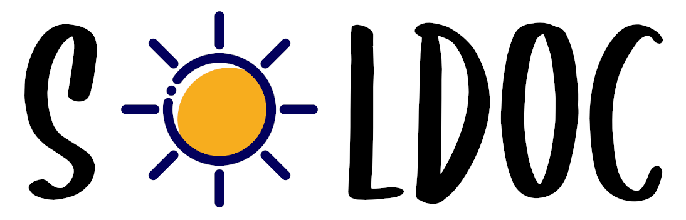

<p align="center">
    
</p>

[](https://www.npmjs.com/package/soldoc)
[](https://travis-ci.org/HQ20/soldoc)
[](https://coveralls.io/github/HQ20/soldoc?branch=master)

soldoc is a solidity documentation generator. This generator was created due to a need of giving documentation to developers and clients. Thinking about it, we first created this tool to generate an HTML self hosted page, but then we also decided to generate a PDF.

See demo [here](https://soldoc-demo.netlify.com/).

Please note that, there's also a pdf example in `./example` folder. This pdf is a first draft. We intend to have a better template soon and open the opportunity to get new templates.

## Features
* Generates documentation with soft colors :eyes:
* The generated output can be pure HTML :grin:, a PDF file :necktie:, gitbook format :scream: or docsify format :boom:
* All formats support emojis :speak_no_evil:
* Ignore documentation generator for some specific files :sunglasses:
* Really fast :rabbit2:

## Installation and Usage

```bash
# Move to your project folder.
cd project-folder/

# Install soldoc.
npm install --save-dev soldoc

# Run soldoc.
soldoc docs/ Sample.sol

# View documentation
open ./docs/Sample.html
```

soldoc supports many output formats, being pure HTML the default one.

Use `soldoc --help` to get more information about output formats and other options.

## Use internally

Your can also use soldoc within your project
```ts
import { generate } from 'soldoc';

generate(toPdf: boolean, outputFolder: string, filePathInput: string)
```

## Contributing
Pull requests are welcome. For major changes, please open an issue first to discuss what you would like to change.

Please make sure to update tests as appropriate.

## Credits
Credits to all external open/free material used.

Thank you all.

### Logo
The sun
* https://www.iconfinder.com/icons/2995005/giallo_sole_soleggiato_sun_sunny_weather_yellow_icon
* https://creativecommons.org/licenses/by/3.0/

### Font Family
* https://www.dafont.com/pt/subscriber.font

Thank you. Danke. Merci. Grazie. Gracias. Arigato. Obrigado.

## Thanks to
* [Connor](https://github.com/connorltodd), who drafted the initial HTML template.
* [zlocate](https://github.com/zlocate)

## License
[GPL-3.0](LICENSE)
